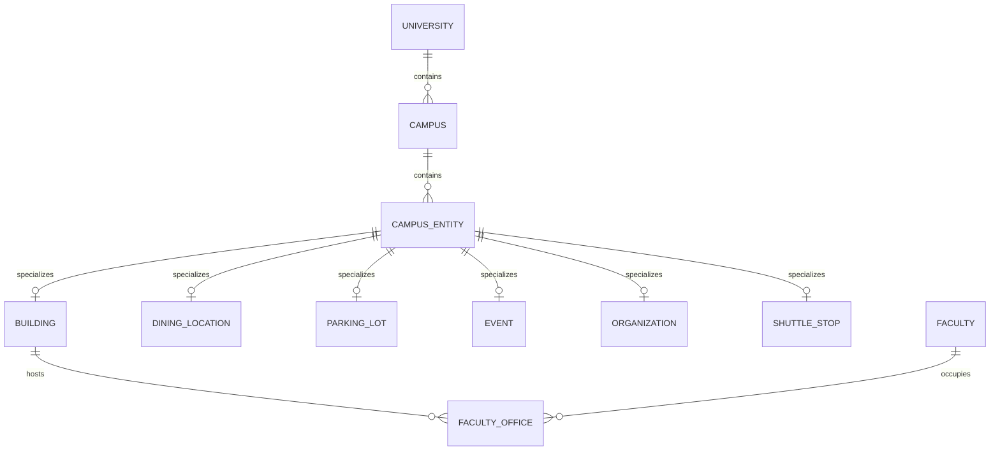

# Canonical domain model

## Purpose

Define the platform concepts that must remain consistent across providers, frontend projections, APIs, search, and AI. The current TypeScript provider types are the practical starting point; this document describes the normalized target contract.

## Hierarchy

## Shared fields

Every persisted campus entity must carry:

| Field | Rule |
| --- | --- |
| `id` | Stable opaque UUID. |
| `universityId`, `campusId` | Required scope once multi-campus persistence is introduced. |
| `kind` | Controlled entity discriminator. |
| `slug` | Unique within a campus; mutable only through an explicit redirect/alias strategy. |
| `name`, `aliases` | Human-readable discovery fields. |
| `provenance` | Source URL/identifier, source class, and verified/updated timestamps. |
| `status` | Active, inactive, unavailable, or pending review; never inferred from missing data. |
| `createdAt`, `updatedAt` | Audit fields. |

Spatial entities additionally carry WGS84 coordinates and optional GeoJSON geometry. Geometry must be validated before it is rendered or persisted.

## Key specializations

- **Building:** code, category, entrances, accessibility features, hours, departments, amenity references, and footprint.
- **Faculty:** display name, department reference, public contact information, source profile, and zero or more office assignments. Faculty is not itself a map point; an office assignment is spatial.
- **Dining location:** venue category, hours, meal-plan attributes, dietary metadata, source freshness, and optional building reference.
- **Parking lot:** permit rules, accessible availability, hours/restrictions, and occupancy only when a real feed supports it.
- **Event:** time range, organizer, location reference, RSVP/action URL, and source freshness.
- **Organization:** category, contact/action channels, and meeting metadata.

## Identity and references

Use UUIDs between services and persistence. Accept a slug only at public lookup boundaries, resolve it to an ID early, and return canonical IDs. Do not use display names as foreign keys.

## Current mapping

The current frontend has separate interfaces such as `CampusBuilding`, `FacultyMember`, `DiningVenue`, `ParkingLot`, `CampusEvent`, and `SearchResult` in `src/providers/types.ts`. The current database contains `buildings` and `faculty` tables. The next migration should add `universities` and `campuses` before adding more provider-scoped tables; it should not rename all existing types at once.
