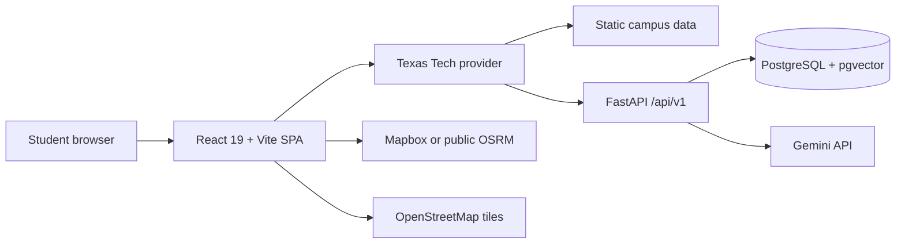
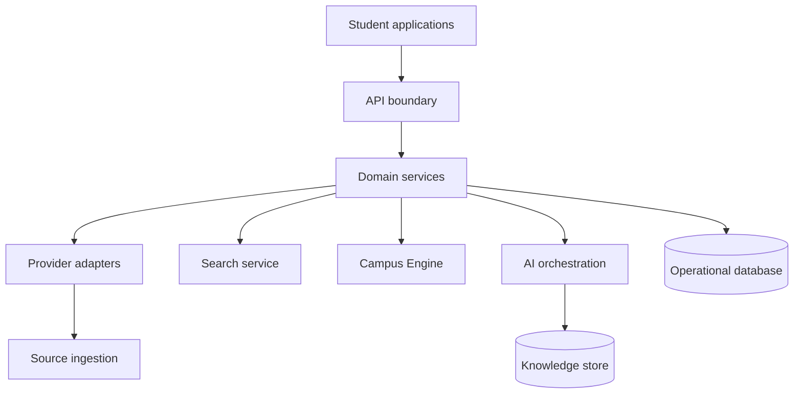

# System overview

## Scope

This document describes the present Lumisync application architecture and the target boundaries for incremental evolution. It does not prescribe a monorepo migration or a rewrite.

## Current architecture

The React application uses React Router, TanStack Query, an application context, Leaflet, and a `UniversityProvider` interface. `texasTechProvider` currently adapts static data and selected FastAPI endpoints. The FastAPI service exposes health, chat, buildings, faculty, and issue-reporting routes. PostgreSQL stores buildings, faculty, issue reports, waitlist signups, and Texas Tech RAG chunks.

## Target system boundaries

The target is boundary evolution, not immediate service decomposition. Initially these modules may remain within the current frontend and FastAPI repositories, provided their contracts are explicit.

## Architectural rules

1. UI code never imports raw campus data outside a provider or approved fixture.
2. API routes contain validation and transport concerns only; domain logic moves to services.
3. The provider identifier must be available at every externally scoped data boundary.
4. Entity IDs are opaque and stable; slugs are human-facing lookup keys.
5. RAG retrieval uses source metadata and returns citations to the client contract.
6. Database migrations are deployed explicitly, not run as a side effect of serving traffic.

## Request lifecycles

### Campus discovery

`Page ? provider hook ? provider ? API or static fallback ? normalized entity ? UI projection`

### Lumi request

`Client message ? validation/rate limit ? retrieve provider-scoped evidence ? compose model context ? stream structured response/citations ? render`

## Current gaps to close

- `university_id` exists in the chat request but retrieval is currently hard-coded to the Texas Tech knowledge table.
- In-memory chat rate limiting is process-local.
- Startup initializes schema and runs data migration; deployment migration must become separate.
- The API streams chat text but does not expose retrieved citations in its response body.

## Related documents

- [Domain model](domain-model.md)
- [Repository guide](repository.md)
- [Backend architecture](../05-backend/architecture.md)
- [Provider SDK](../10-providers/provider-sdk.md)
